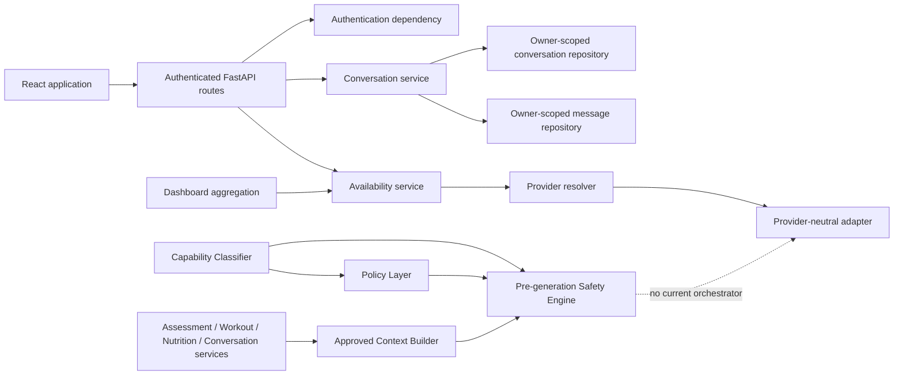

# RAHFIT AI — Architecture Gate Review Before Provider Generation

**Review type:** Architecture, security, privacy, and operational readiness gate

**Gate status:** `READY_WITH_REQUIRED_FIXES`

**Reviewed baseline:** Provider infrastructure, conversation domain, Approved Context Builder, Policy Layer, Capability Classifier, and deterministic pre-generation Safety Engine
**Implementation scope:** Documentation and verification only; no prompt, provider call, generation endpoint, memory, usage store, or frontend AI Coach was added

## 1. Reviewed Scope

The review used implementation and tests as the source of truth. It inspected:

- Provider models, protocol, OpenAI-compatible adapter, resolver, availability service, settings, fake provider, and tests.
- Conversation models, request/response schemas, owner-scoped repositories, lifecycle service, controllers, limits, indexes, and tests.
- Context models, purposes, limits, source protocols, source loading, minimization, truncation, omission metadata, ownership checks, and tests.
- Policy capabilities, requested actions, forbidden actions, decisions, reason codes, rule table, and tests.
- Classifier capabilities, special outcomes, priority, bilingual normalization, confidence, unsupported behavior, and tests.
- Safety models, precedence, context ownership, message rules, provider eligibility, logging, and tests.
- Authentication dependency, error conventions, structured logging, global rate limiting, dashboard AI availability, and index initialization.
- Frontend API client, authentication integration, localization/RTL foundation, Design System primitives, routing, and tests.
- Existing AI, API, database, UX, and implementation documentation.

No current generation path exists. This is correct for the reviewed baseline.

## 2. Current Architecture



The implemented layers are intentionally independent. The dashed edge does not exist in code: no service currently converts an approved safety result into a provider request.

## 3. Validated Request Pipeline

### 3.1 Review of the proposed order

The original order—authenticate, validate conversation, normalize, classify, evaluate policy, build context, run safety, construct prompt, resolve provider, generate, validate, persist, record usage, return—is safe but not optimal.

Context must exist before **context-aware** safety because injury, allergy, dietary, readiness, minor, and assessment-stop decisions depend on the approved safety section. However, building full context before obvious unsupported, injection, secret-extraction, and policy-denied outcomes performs avoidable owner-scoped reads and creates unnecessary sensitive data in memory.

The correct decision is a staged pipeline: message-only deterministic preflight first, approved context second, context-aware safety third.

### 3.2 Recommended final request sequence

1. Authenticate the user through the existing dependency.
2. Load the conversation by conversation ID and authenticated owner; require `active` status.
3. Validate content type, bounded message, plain text, locale, and idempotency key.
4. Create or recover an owner-scoped generation-request reservation; do not call the provider for a duplicate or in-flight request.
5. Preserve the bounded display message and produce a separate normalized classification/safety value.
6. Classify capability.
7. Use one exhaustive typed mapper to derive the policy action, approved context purpose, and any terminal special-route behavior.
8. Evaluate policy.
9. Run message-only deterministic preflight for injection, extraction, forbidden actions, unsupported outcome, low confidence, and policy terminal decisions.
10. Return a deterministic Python result immediately for a terminal preflight outcome; do not build context or call a provider.
11. Resolve local provider configuration. Disabled, setup-required, or unsupported configuration stops before context retrieval.
12. Build minimum approved owner-scoped context for the mapped purpose.
13. Run the existing context-aware Safety Engine and require `requires_provider=true`.
14. Persist the accepted user message once and transition the generation request to provider-in-progress atomically.
15. Construct a bounded provider-neutral request through the future Prompt Orchestrator.
16. Invoke the resolved provider once.
17. Validate the structured output with the future post-generation Output Validator.
18. Stage the validated output and usage on the generation request so persistence can be retried without another provider call.
19. Atomically append the assistant message, record usage, and mark the generation request completed.
20. Return a bounded API response. Never return or expose raw prompts, context, vendor exceptions, or unvalidated output.

This sequence reduces privacy exposure and cost while retaining all context-dependent safety rules.

## 4. Contract Compatibility Matrix

### 4.1 Capability routing

| Classifier outcome | Policy capability/action | Context purpose | Safety route | Gate finding |
| --- | --- | --- | --- | --- |
| `explain_assessment` | `explain_assessment` / `explain` | `explain_assessment` | Normal context-aware | Compatible |
| `explain_workout` | `explain_workout` / `explain` | `explain_workout_plan` | Normal context-aware | Compatible through explicit mapper |
| `explain_nutrition` | `explain_nutrition` / `explain` | `explain_nutrition_plan` | Normal context-aware | Compatible through explicit mapper |
| `explain_progress` | `explain_progress` / `explain` or `summarize` | No dedicated purpose exists | Normal context-aware | **Required fix** |
| `motivate` | `motivate` / `encourage` | `safe_motivation` | Normal context-aware | Compatible through explicit mapper |
| `summarize` | `summarize` / `summarize` | `summarize_current_plan` | Normal context-aware | Compatible through explicit mapper |
| `suggest_workout_alternative` | Same capability / `recommend` | `suggest_approved_workout_alternative` | Limited/caution | Section allowlists disagree; **required fix** |
| `suggest_nutrition_alternative` | Same capability / `recommend` | `suggest_approved_nutrition_alternative` | Limited/caution | Section allowlists disagree; **required fix** |
| `medical_related` | No `AICapability` equivalent | No provider purpose required for terminal cases | Professional guidance | No valid Policy request mapping; **blocker** |
| `unsupported` | No `AICapability` equivalent | None | Refuse/fallback | No valid Policy request mapping; **blocker** |

Separate enums are appropriate because the classifier, policy, context, safety, and provider are separate bounded domains. They should not be merged cosmetically. One exhaustive internal mapper must own every cross-domain conversion and fail closed for unknown combinations.

### 4.2 Decision compatibility

| Policy result | Safety result | Provider behavior |
| --- | --- | --- |
| `allow` | Must still become `allow`, caution, refusal, guidance, or fallback after safety | Call only for final allow/caution |
| `allow_with_limits` | Normally `allow_with_caution`; stronger safety wins | Call with explicit caution contract |
| `deny` | Cannot become allow | Deterministic refusal; no provider |
| `professional_guidance_required` | Cannot become allow | Deterministic guidance notice; no provider |
| Classifier `unsupported` | Safety refuse/fallback | No provider |
| Low confidence | Safety fallback | Deterministic clarification/fallback; no provider |

Safety already enforces provider eligibility consistently. The future application service must treat `AISafetyResult.requires_provider` as authoritative and must not reinterpret reason codes.

### 4.3 Message and provider contracts

| Boundary | Current contract | Review result |
| --- | --- | --- |
| Conversation message | Plain text, maximum 4,000 characters | Safe storage boundary, but larger than context question limit |
| Context question | Maximum 1,000 characters | Safe generation-input candidate |
| Classifier input | No independent public length contract | Must receive the already bounded normalized message |
| Safety message | Maximum 4,000 normalized characters | Compatible, but future endpoint needs one authoritative input limit |
| Provider approved content | Maximum 30,000 characters | Must be produced only by the Prompt Orchestrator, never direct client input |
| Provider output | Text up to 20,000 characters plus optional structured payload | Structured payload is not currently requested or populated by the configured adapter |
| Frontend request timeout | 12 seconds | Shorter than backend provider maximum of 15 seconds; unsafe for retries without idempotency |

Recommended generation message limit is 1,000 characters for the first bounded flow. Conversation storage may retain its broader 4,000-character domain limit for non-generation lifecycle notices and future controlled uses.

## 5. Ownership and Authorization Boundaries

| Boundary | Evidence | Result |
| --- | --- | --- |
| Authentication | `get_current_user` derives identity from validated access token and active user state | Strong |
| Public conversation schemas | No owner, role, status, timestamps, provider, or internal metadata accepted | Strong |
| Conversation reads/mutations | Repository filters include conversation ID and authenticated user ID | Strong |
| Missing/cross-user conversation | Read/close return the same safe not-found behavior; delete is idempotent no-content | Strong existence protection |
| Message roles | User, assistant, and lifecycle roles use distinct trusted service methods | Prevents public role impersonation |
| Closed conversation | Normal user/assistant append rejected; race is checked again during atomic parent update | Strong lifecycle guard |
| Deleted records | Parent queries exclude deleted status; message queries exclude deleted messages | Strong |
| Context sources | Every source call uses authenticated `User.id`; returned owners are checked again | Strong |
| Conversation in context | Explicit, owner-scoped, purpose-limited, bounded, and deleted messages excluded | Strong |
| Safety context | Request owner and approved-context owner must match authenticated user | Strong |
| Future memory | No memory exists; future store must use the same user/source/consent scoping | Ready by pattern, not implemented |

No public payload currently controls an owner ID. Internal conversation service methods accept a trusted `user_id` string, so the future generation application service must accept the authenticated `User` and derive all downstream owner references itself. It must not expose internal services through dependency injection that accepts a caller-selected owner.

There is no object-level authorization blocker in the existing persistence and context layers.

## 6. Context and Privacy Review

### Validated strengths

- Purpose-based source and section allowlists.
- Authentication-derived source queries and owner revalidation.
- Mandatory safety section with explicit not-assessed state.
- Context version `rahfit-ai-context-v1`.
- Complete UTF-8 serialized-size limit of 12,000 bytes.
- Bounded conversation history: eight messages and 2,000 combined characters.
- Section-specific truncation plus inclusion/omission metadata.
- Forbidden credentials, email, internal IDs, generation keys, database metadata, and deleted data excluded by tested projections.
- Optional-source failures are represented without substituting unrelated data; required assessment dependency failure stops.
- Deterministic builds with injected time and no persistence/provider/network behavior.
- Full question and context are not logged.

### Required consumption rules

- The Prompt Orchestrator receives only `AIApprovedContext`; it never imports repositories or raw product models.
- Provider adapters receive only the orchestrator's bounded strings/structured request, never `AIApprovedContext`, `User`, assessment, workout, nutrition, or database models.
- Inclusion reasons, omission reasons, owner reference, size calculations, data-source names, and operational metadata are not automatically sent to the provider.
- Only sections present in `AISafetyResult.allowed_context_sections` may be serialized into provider content.
- The current user message remains an isolated untrusted segment, not concatenated into system policy.
- Raw context and prompts are never logged or persisted.

### Privacy findings

`ConfigDict(frozen=True)` does not deeply freeze nested `dict` and `list` values in context sections, provider metadata, or finding metadata. Current services do not mutate them and tests verify unchanged context, but the future Prompt Orchestrator should consume a defensive immutable projection rather than modify section data in place.

The future orchestration contract also needs a distinction between:

- Bounded original/display message for persistence and user-visible history.
- Normalized message for classifier and safety matching.
- Purpose-minimized provider user segment produced by the orchestrator.

Conflating these values would damage history fidelity or weaken safety normalization.

## 7. Policy, Classifier, and Safety Review

### Validated strengths

- Classifier normalization handles English, Arabic, mixed language, punctuation, case, Arabic variants, diacritics, and stable priority.
- Medical-related content has highest classifier priority; alternatives precede general explanations.
- Unsupported and low-confidence results are explicit.
- Policy capabilities and normal actions use allowlists; forbidden actions have stable deny/guidance results.
- Safety precedence is deterministic and fail closed.
- Injection, extraction, medical, urgent symptom, injury, allergy, dietary, dangerous nutrition, dangerous workout, drug, supplement, minor, readiness, and stop-status rules are covered.
- Policy deny and professional guidance cannot be upgraded.
- Context owner mismatch and missing mandatory safety data cannot proceed.
- Only allow/caution results set provider eligibility true.
- Findings and logs use safe identifiers, not complete messages or context.

### Pre-context versus context-aware checks

The following can run before Context Builder:

- Unsupported classifier result.
- Low-confidence fallback.
- Policy deny or professional-guidance result.
- Message-only injection, secret extraction, safety bypass, prohibited technical action, diagnosis, treatment, medication, urgent symptom, dangerous calorie/fasting behavior, extreme workout language, and drug/PED language.

The following require approved context:

- Owner consistency.
- Assessment availability, stop/caution status, risk, readiness, and minor status.
- Confirmed injuries and workout restrictions.
- Confirmed allergies and dietary restrictions.
- Capability-specific available plan and progress sections.

The current `AISafetyEngine.evaluate_safety` validates a complete approved context before evaluating message-only candidates. That is secure but causes unnecessary reads for obvious terminal requests. A two-stage API must reuse the same rule catalog and precedence; it must not fork or duplicate safety rules.

### User-facing safety ownership

Prompt-injection refusal, unsupported fallback, policy denial, professional-guidance notice, assessment-required state, and other terminal safety responses must be deterministic Python-owned templates selected by stable reason code. They must not be generated by a provider.

## 8. Provider Abstraction Readiness

### Ready

- Provider-neutral protocol and direct dependency injection.
- Configured adapter isolated from domain services.
- Disabled-by-default feature and startup without a key.
- Local resolver with stable disabled/setup/unsupported/available states.
- Bounded timeout and output-token configuration.
- Stable provider error categories for timeout, rate limit, authentication, unavailability, invalid response, and unexpected failure.
- Token usage, latency, provider request ID, provider, and model fields.
- Deterministic fake provider and in-memory HTTP adapter tests.
- No streaming, tools, browsing, files, agents, or automatic retry.
- Secrets remain inside the adapter.

### Required before first real generation

1. Add an explicit output-contract mode/version to the provider-neutral request. For the first flow, require one bounded structured response shape; do not rely only on prose requesting JSON.
2. Make the configured adapter request the supported structured/JSON response mode and populate `structured_payload`, or return a typed text candidate for a dedicated parser. The behavior must be provider-neutral above the adapter.
3. Map all response-model validation failures—including oversized text or invalid typed usage—into `provider_invalid_response`. `AIProviderResponse` construction currently occurs outside the adapter's parsing error block.
4. Bound metadata keys, values, and count; allow only safe correlation/version identifiers.
5. Keep the Prompt Orchestrator independent of `AIProvider`. It should produce a provider-neutral generation request. A generation application service should resolve the provider, invoke it, validate output, persist state, and map failures.

The smallest clean boundary is:

`Prompt Orchestrator → AIProviderRequest → Generation Application Service → AIProvider → Output Validator`

## 9. Future Prompt Orchestrator Contract

### Recommended inputs

- Trusted classifier result.
- Trusted policy result.
- Final safety result with `requires_provider=true`.
- Approved context whose owner and version were already verified.
- Bounded original current message and its normalized counterpart as distinct fields.
- Mapped capability and context purpose.
- Configured maximum output tokens, never above provider configuration.
- Approved locale/communication preference when present in context or trusted runtime metadata.
- Prompt template version and output-contract version selected by server configuration.
- Operational owner or conversation references only when required for correlation; never embedded in provider content.

### Recommended outputs

- Provider-neutral `AIProviderRequest`.
- Prompt version.
- Output-contract version.
- Included approved context section names.
- Safety/caution flags and stable reason codes.
- Deterministic fallback response key.
- Safe orchestration metadata: capability, versions, size counts, and correlation identifiers.
- A fingerprint of template/context versions when operationally needed; never raw prompt text.

### Segment separation

The orchestrator maintains distinct internal segments:

1. System policy: immutable approved safety and product boundary template.
2. Capability instruction: one versioned bounded task instruction.
3. Approved context: deterministic serialization of allowed sections only.
4. User message: bounded untrusted plain text with explicit data delimiters.
5. Output contract: required fields, lengths, enum values, and refusal of plan mutation/tools.

It must not request chain-of-thought. A concise user-facing rationale field may be requested, but private reasoning must not be requested, stored, or returned.

Raw prompts should not be persisted. Store only prompt version, output-contract version, included section names, safety result, model/provider, sizes, usage, latency, and a non-reversible fingerprint when required for debugging. Development-only prompt inspection should be opt-in, local, redacted, time-limited, and impossible in production configuration.

## 10. Future Post-Generation Output Validator

### Recommended input

- Typed provider candidate.
- Expected output-contract version.
- Capability, policy, and safety results.
- Relevant immutable approved restriction projection.
- Prompt/provider version metadata without raw credentials or hidden prompts.

### Required checks

- Required fields, enum values, type correctness, and output-contract version.
- Per-field and total maximum lengths.
- Allowed response/action type for the capability.
- No workout or nutrition plan mutation command.
- No tool, browsing, file, database, code-execution, or administrative action.
- No diagnosis, treatment, prescription, dosage, or unsupported clinical certainty.
- No conflict with approved injuries, allergies, dietary restrictions, stop state, or professional-guidance state.
- No secret, system prompt, hidden instruction, internal context, owner ID, or operational metadata leakage.
- No HTML, script, event handler, URL injection, or hidden markup.
- No instruction to bypass Python-owned rules.
- No unsupported certainty, fabricated application facts, or fabricated source claims.

### Result types

| Result | Behavior |
| --- | --- |
| `accepted` | Candidate may be persisted and returned. |
| `rejected_with_fallback` | Discard candidate; return deterministic capability fallback. |
| `professional_guidance_required` | Discard candidate; return deterministic guidance notice. |
| `blocked` | Discard candidate; record safe high-severity validation metadata. |

Pre-generation phrase groups, restriction projections, reason-code taxonomy, and deterministic thresholds may be shared through focused common rule data. Post-generation schema validation, leakage scanning, action validation, and response-field constraints require a dedicated validator; the pre-generation engine must not be called as if provider output were a user request.

## 11. Conversation Persistence Sequence

### Current readiness

Current conversation/message persistence is owner-scoped, bounded, role-safe, lifecycle-safe, and compensates by soft-deleting a message if the parent state changes during append. It is not a generation transaction system:

- No public message route exists.
- No idempotency key or generation request record exists.
- No one-in-flight lock exists.
- User and assistant messages are appended separately.
- A process crash between message insert and counter update can leave recoverable counter drift.
- No persisted provider-success state exists to retry database finalization without another paid call.

### Required generation sequence

1. Require a client idempotency key and create/find an owner/conversation-scoped `ai_generation_requests` record.
2. Atomically reject a second in-flight request for the same conversation.
3. Perform classification, policy, preflight, context, and full safety under the reservation.
4. For a deterministic terminal result, atomically persist the user message and a Python-owned system notice when transcript retention is appropriate, then finalize the request without provider metadata.
5. For an allowed result, atomically persist the user message once and move the request to provider-in-progress while confirming the conversation remains active.
6. Call the provider once. Do not automatically retry ambiguous timeouts.
7. Validate the provider candidate before it becomes a conversation message.
8. Persist a bounded validated candidate and usage on the private generation request as `provider_succeeded`; never persist rejected raw output.
9. In one transaction, insert the unique assistant message, record usage, update conversation activity/count, and mark the generation request completed.
10. If finalization fails, retry from the staged validated candidate using the same generation request; do not call the provider again.
11. On provider or validation failure, atomically add a deterministic system notice when appropriate and mark the request failed/blocked.

This design preserves transcript truthfulness, prevents duplicate assistant messages, avoids orphaned provider success, prevents role impersonation, and makes expensive-call retries explicit.

## 12. Database Readiness and Future Requirements

### Current collections and indexes

`ai_conversations` and `ai_messages` support owner activity, status, chronological history, owner/conversation isolation, and owner/message lookup. Named initialization is repeatable and replaces only same-name owned drift. No current index definition conflicts with another current definition, and no unsafe TTL index exists.

### Required before provider-backed messaging

#### `ai_generation_requests`

Purpose: idempotency, lifecycle, one-in-flight control, provider-call state, validated candidate staging, failure category, and safe orchestration versions.

Recommended indexes:

- Unique `(user_id, conversation_id, idempotency_key)`.
- Partial unique `(conversation_id)` while status is reserved, safety-processing, provider-in-progress, or provider-succeeded.
- `(user_id, created_at desc)` for quotas and support.
- `(status, updated_at)` for recovery.
- Optional TTL only for safely finalized temporary candidate payload after the assistant message is committed; lifecycle metadata follows retention policy.

#### Message linkage

Add an internal generation-request reference to generated/system messages and enforce one message per generation request and role where applicable. Existing historical messages remain compatible through an optional versioned field.

#### `ai_usage`

Purpose: unique invocation metering without prompt/content storage.

Recommended indexes:

- Unique generation-request reference.
- `(user_id, created_at desc)`.
- `(provider, model, created_at)` for operations.
- Period/billing aggregation indexes only when actual queries exist.

### Later collections

- `ai_feedback`: target message/generation, owner, bounded rating/category, safety flag; index by target and time.
- `ai_memory`: user/category/state/source/consent/expiration; partial uniqueness for active governed memory and policy-approved expiry.
- Evaluation cases/results: versioned non-production fixtures or redacted approved samples, never uncontrolled conversation copying.

Governed memory, feedback, and vector storage remain post-generation work and are not gate prerequisites for the first bounded flow.

## 13. Rate Limits and Cost Controls

| Control | Owning layer | Recommendation |
| --- | --- | --- |
| Content type and message length | Controller/schema | First generation message maximum 1,000 characters; reject before service work. |
| Generic abuse burst | Middleware | Retain coarse IP limit, but do not treat it as AI cost control. |
| Authenticated per-minute/day quota | Generation application service plus shared/persistent counter | Configurable user-based limits; stable quota result and retry time. |
| One in-flight request | Repository/database | Partial unique index plus atomic state transition. |
| Idempotency | Controller requires key; application/repository enforce | Return existing completed/pending result; never repeat provider call. |
| Context size | Context Builder | Keep existing 12,000-byte hard limit. |
| Output tokens | Orchestrator and provider adapter | Orchestrator may request less; adapter remains the final configured cap. |
| Duplicate message | Application/repository | Hash only bounded operational identifiers if useful; primary protection is idempotency key. |
| Timeout | Provider adapter and API client | Backend timeout must be shorter than the client's endpoint-specific timeout. |
| Token/cost metadata | Generation service/usage repository | Persist typed counts and cost band, never prompts/content. |
| Limit fallback | Python response mapper | Deterministic localized response; provider is not called. |

The existing in-memory IP middleware is explicitly a single-instance baseline. Before a public provider endpoint, user-scoped quota and idempotency must not depend only on process memory.

## 14. Failure and Fallback Matrix

The stable categories below are recommended generation-layer contracts; they are not current public API claims.

| Case | Provider called | User message persisted | Deterministic response | Retry safety | Stable category | Safe log metadata |
| --- | --- | --- | --- | --- | --- | --- |
| AI feature disabled | No | No | Feature-disabled notice | After configuration change | `ai_feature_disabled` | User, conversation, category |
| Missing API key | No | No | Setup-unavailable notice | After configuration change | `ai_provider_setup_required` | Provider/model category only |
| Provider configured unavailable | No | No | Temporary-unavailable notice | Backoff/recheck | `ai_provider_unavailable` | Provider/model/category |
| Provider timeout | Attempted | Yes, once | Temporary failure system notice | No automatic retry unless provider idempotency proves safety | `provider_timeout` | Generation ID, provider/model, latency |
| Provider rate limit | Attempted | Yes, once | Rate-limit notice | After bounded backoff using request state | `provider_rate_limited` | Generation ID, provider/model, retry band |
| Provider authentication failure | Attempted | Yes, once | Configuration failure notice | Not until configuration fixed | `provider_authentication_failure` | Provider/model/category; no credential |
| Invalid provider output | Yes | Yes, once | Deterministic validation fallback | Do not automatically regenerate | `output_rejected` | Contract/prompt/model versions, validator reason |
| Unsupported request | No | Optional transcript pair, once | Unsupported-scope response | Safe with same idempotency result | `unsupported_request` | Capability/reason only |
| Prompt injection/extraction | No | Optional transcript pair, once | Refusal | Same request returns same refusal | `safety_refused` | Safe rule IDs only |
| Policy deny | No | Optional transcript pair, once | Refusal | Same request returns same refusal | `policy_denied` | Policy reason/capability |
| Professional guidance | No | Optional transcript pair, once | Guidance notice | New request only after user action/context change | `professional_guidance_required` | Safe reason/safety version |
| Missing assessment | No | Optional transcript pair | Assessment-required notice | After assessment completion | `assessment_required` | Purpose and omission category |
| Missing mandatory safety context | No | No assistant generation | Safe fallback | Retry after dependency recovery | `safety_context_unavailable` | Context version/error category |
| Ownership failure | No | No | Safe not-found/denied response | Only with correct owned resource | `resource_not_found` | Request ID and route; no foreign ID details |
| Closed conversation | No | No | Closed-state response | New conversation required | `conversation_closed` | Owner/conversation/state |
| Duplicate request | No new call | No duplicate | Existing completed result or pending state | Poll/replay same key | `duplicate_request` / `request_in_progress` | Generation/idempotency fingerprint |
| Database failure before provider | No | No or transaction rolled back | Temporary backend notice | Safe with same idempotency key | `generation_persistence_unavailable` | Operation/category/request ID |
| Database failure after provider | No second call | User already persisted | Pending/finalization notice | Retry finalization from staged candidate | `generation_finalization_pending` | Generation/provider request IDs, no content |

“Optional transcript pair” must be one documented product decision. Recommended default for an explicit conversation send is to retain the owner-visible user message plus deterministic system notice atomically, subject to deletion/retention policy. Raw rejected provider output is never retained as a conversation message.

## 15. User-Facing Response Ownership

### Deterministic Python responses

- Prompt-injection, extraction, or safety-bypass refusal.
- Unsupported/out-of-scope request.
- Policy denial.
- Professional-guidance and urgent-symptom notice.
- Assessment-required or safety-context-unavailable state.
- AI disabled/setup-required/provider unavailable.
- User or provider rate limit.
- Closed conversation, duplicate pending request, and ownership-safe not-found.
- Invalid provider output fallback.
- Temporary persistence/backend failure.

These responses are selected by stable internal reason code and localized by application-owned copy. They do not ask a provider to explain why it was blocked.

### Provider-generated responses

Only final safety `allow` and `allow_with_caution` may reach the provider. Caution responses must carry a structured caution flag into prompt construction and output validation. The provider may explain approved assessment, workout, nutrition, or progress facts; motivate; summarize; or suggest only deterministic-engine-approved alternatives. It may never mutate plans or invent approved alternatives.

## 16. Frontend Readiness

### Ready foundation

- Authenticated API client with token refresh and typed error wrapper.
- Availability state already exposed through dashboard aggregation.
- Reusable cards, AI Coach card styling, alerts, empty/error states, skeletons, spinner, buttons, forms, overlays, and progress components.
- English/Arabic locale state and document-level LTR/RTL direction.
- Protected routing, loading states, accessibility roles/live regions, responsive tokens, and reduced-motion Design System support.

### Required when UI work is authorized

- AI availability and entitlement guard before navigation.
- Conversation list/detail types and service.
- Accessible composer with a 1,000-character counter and plain-text behavior.
- Required idempotency key and duplicate-send/in-flight disable state.
- Endpoint-specific timeout longer than the backend provider timeout; the current global 12-second client timeout is shorter than the backend's possible 15-second provider timeout.
- Deterministic fallback, refusal, caution, professional-guidance, rate-limit, offline, and expired-session presentations.
- Localized English/Arabic AI copy; current generic Design System copy is primarily English.
- Focus restoration, keyboard send/newline behavior, `aria-live` response updates, and RTL transcript layout.
- Feedback and memory controls only in their later approved sprints.

The current API client and Design System can support AI Coach without redesign. Feature-specific state and contracts are absent by design.

## 17. Test and Evaluation Readiness

### Existing strengths

- Provider configuration, resolver, fake provider, adapter parsing, error mapping, token metadata, authentication, and secret protection.
- Conversation ownership, lifecycle, fixed roles, bounds, deletion, truncation, endpoint authentication, and migration-safe indexes.
- Every context purpose, owner/source isolation, forbidden fields, size pressure, deletion, source failures, determinism, and no provider/network/log leakage.
- Every policy capability and forbidden action.
- Classifier English, Arabic, mixed-language, priority, unsupported, confidence, determinism, and no provider behavior.
- Safety policy/classifier/context integration, injection, medical, restrictions, dangerous behavior, owner isolation, logging, and no external I/O.
- Startup, authentication, dashboard, assessment, workout, nutrition, frontend, and build regressions.

### Missing tests required before generation endpoint

- Exhaustive classifier-to-policy-to-context typed mapper tests, including special outcomes.
- End-to-end internal application-service tests across conversation, classifier, mapper, policy, context, safety, orchestrator, fake provider, validator, persistence, and usage.
- Idempotency replay, concurrent duplicate, and one-in-flight repository tests.
- Closed/deleted/cross-user conversation races during generation.
- Context-purpose and safety-section compatibility for every capability.
- Provider structured-output schema and oversized/invalid typed response mapping.
- Validator acceptance, rejection, leakage, HTML/script, plan mutation, medical, injury, allergy, and multilingual cases.
- Provider success followed by database failure and retry-without-provider-call.
- Timeout ambiguity and no automatic duplicate paid call.
- Quota/rate-limit and deterministic response contract tests.
- Public endpoint authentication, content type, idempotency header, stable error codes, request ID, and response bounds.
- Frontend duplicate-send, timeout, offline, refusal/caution/guidance, accessibility, and RTL tests when UI is authorized.

Recommended future deterministic structure:

```text
backend/tests/ai_evals/
├── cases/
├── prompt_injection/
├── medical/
├── injury/
├── nutrition/
├── workout/
├── unsupported/
└── multilingual/
```

Cases should be versioned data with exact expected classification, policy, safety, validator, and response categories. Do not use an LLM as a judge.

## 18. Architecture Risks

| Severity | Finding | Affected files/layers | Evidence and consequence | Recommended action | Must fix before provider integration |
| --- | --- | --- | --- | --- | --- |
| Blocker | No exhaustive classifier-to-policy route for special outcomes | `ai_classifier.py`, `ai_policy.py`, future application service | `medical_related` and `unsupported` are not `AICapability`; Policy Service requires one, so orchestration would fabricate or bypass a policy result | Add one typed routing mapper/terminal plan with exhaustive tests | Yes |
| High | Progress has no approved context purpose | `ai_context.py`, `ai_context.py` service, classifier | `explain_progress` is allowed by classifier/policy/safety but cannot request a dedicated Context Builder purpose | Add a purpose and minimum section contract, or explicitly remove/defer the capability | Yes |
| High | Alternative context allowlists disagree | Context Builder purpose table versus Safety Engine `_CAPABILITY_CONTEXT` | Builder supplies goals/profile while Safety blocks them and expects assessment; future prompt content becomes ambiguous | Reconcile one reviewed per-capability section contract and test both layers | Yes |
| High | No generation idempotency or in-flight state | Conversation models/services/repositories/indexes | Duplicate sends can cause repeated paid calls and duplicate assistant messages; finalization cannot recover safely | Add generation-request ledger, unique indexes, state machine, and transactional/idempotent finalization | Before any public/real provider call |
| High | Structured output is not enforced | `app/ai/providers.py` | Request has no output-contract mode; adapter never populates structured payload; unsafe prose cannot be reliably validated | Add provider-neutral output contract and dedicated post-generation validator | Before any provider output reaches a user |
| High | Some provider response validation can escape stable mapping | `OpenAICompatibleProvider.generate` | `AIProviderResponse` validation occurs outside the response parsing `try`; oversized text may raise raw validation error | Map model validation into `provider_invalid_response`; add regression test | Yes |
| High | No user-scoped AI quota | Rate-limit middleware and future generation service | Current limit is in-memory and IP-based; it does not prevent authenticated daily cost abuse or multi-instance bypass | Add persistent/shared user quota and deterministic limit response | Before public/paid rollout |
| Medium | Full context is required before message-only safety | `AISafetyEngine.evaluate_safety`, Context Builder | Obvious injection/unsupported requests trigger avoidable sensitive reads | Add a staged preflight reusing the same rule catalog, followed by context-aware safety | Before production optimization; recommended before first flow |
| Medium | Input limits are inconsistent | Conversation, Context Builder, Safety, provider contracts | A 4,000-character stored message can exceed the 1,000-character context question boundary | Define one generation input contract at 1,000 characters | Yes |
| Medium | Frontend timeout is shorter than backend provider timeout | `frontend/src/services/apiClient.ts`, settings | Client may abort at 12 seconds while backend/provider continues up to 15 seconds, encouraging unsafe duplicate retries | Add endpoint-specific timeout/cancellation semantics after idempotency exists | Before UI exposure |
| Medium | Nested “frozen” context remains mutable | Context/provider/safety Pydantic dict fields | A future orchestrator could accidentally mutate approved data | Serialize a defensive immutable projection and regression-test non-mutation | During Prompt Orchestrator implementation |
| Medium | No full-pipeline integration tests | Backend test layout | Strong layer tests do not prove exhaustive mappings, ordering, persistence, and failure composition | Add fake-provider application-service and deterministic eval tests | Before endpoint release |
| Low | Availability is configuration readiness, not live provider health | Resolver/dashboard | UI can show available without a network probe | Keep copy explicit; generation handles real failure deterministically | No |
| Informational | Memory, feedback, and vector storage are absent | AI data layer | Intentionally deferred; no current uncontrolled memory risk | Preserve deferral until consent, retention, and evaluations exist | No |

## 19. Gate Decision

### `READY_WITH_REQUIRED_FIXES`

The completed foundations are safe, modular, strongly typed, owner-isolated, deterministic, and well tested. No broad rewrite or separate architecture redesign is required.

Prompt construction must not begin until the following compatibility defects are resolved:

1. Exhaustive typed mapping from classifier outcomes to policy action, context purpose, and terminal behavior.
2. A dedicated `explain_progress` context decision.
3. Reconciled alternative capability section allowlists.
4. Stable provider invalid-response mapping and an explicit structured output contract.
5. One authoritative bounded generation-message contract.

Before a real or public provider call is enabled, the next implementation must also include message-only preflight, post-generation validation, idempotency, one-in-flight control, recoverable persistence, usage/quota metadata, deterministic failure responses, and full-pipeline tests.

## 20. Required Next Action

Run a focused compatibility and generation-control sprint before the Prompt Orchestrator creates any prompt:

**Recommended sprint:** `Sprint 2.4C — AI Integration Contracts and Generation Control Foundation`

Scope:

- Typed capability/action/context-purpose mapper including terminal special outcomes.
- Progress context purpose and reconciled allowed-section contract.
- Shared staged preflight interface without duplicating safety rules.
- Bounded generation input and structured output contracts.
- Provider invalid-response compatibility fix.
- Generation request/idempotency/in-flight state and indexes.
- Post-generation validator contract implementation.
- Persistent safe usage/quota metadata sufficient for the first bounded flow.
- Deterministic cross-layer integration tests using only the fake provider.

After this sprint passes its gate, implement the Prompt Orchestrator as a pure bounded request builder, then enable one internal fake-provider vertical slice before any configured real-provider or public message endpoint.
