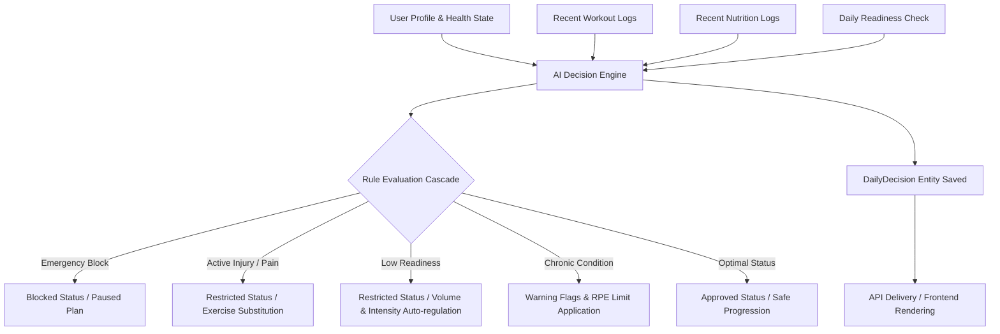

# RAHFIT AI Decision Engine

A production-grade, explainable, safety-first AI Decision Engine written in Python to drive daily adaptations, safety gating, and clinical risk checks for training, nutrition, and recovery.

## Core Objectives
1. **Safety-First Gates**: Ensure no workout or nutritional recommendations violate clinical boundaries.
2. **Explainable AI**: Avoid black-box machine learning. Use deterministic, expert-driven logic that translates rules into clear English and Arabic rationales.
3. **Adaptive Auto-regulation**: Continuously modify volume, intensity, and caloric deficit targets based on daily physiological markers (readiness, soreness, sleep, stress).
4. **Musculoskeletal Substitution**: Automatically map localized joint injuries to orthopedic-safe alternatives.

---

## Architectural Overview



---

## Key Rules & Gating Cascade

### 1. Emergency Safety Block (Refusal Gate)
If the user reports critical physiological signs (e.g., chest pain, fainting, or joint pain intensity $\ge 8/10$), all training is immediately paused.
- **Decision Status**: `BLOCKED`
- **Output**: Pauses normal progression, flags critical warnings in English and Arabic, and advises consulting a physician.

### 2. Medical Clearance Verification Gate
If the user has pre-existing conditions requiring physician clearance (`requires_medical_clearance = True`) and clearance has not been recorded, planning is restricted.
- **Decision Status**: `BLOCKED`
- **Output**: Limits training access and prompts validation of medical clearance certificate.

### 3. Joint Injury & Orthopedic Substitutions
If the user has an active localized musculoskeletal injury, the engine excludes biomechanical patterns loading the affected joint. It looks up safe alternatives from a clinical mapping database:
- **Knee Injury**: Replaces barbell back squats with Spain banded squats or wall sits to preserve quad activation without joint shear stress.
- **Shoulder Injury**: Replaces overhead pressing with landmine pressing to bypass subacromial impingement.
- **Lumbar Strain**: Replaces conventional deadlifts with high-handle trap-bar deadlifts.

### 4. Chronic Condition Adaptation Protocols
Applies specialized medical protocols dynamically:
- **Hypertension**: Limits maximum training RPE to 7, extends warm-ups and cooldowns by 5 minutes, and restricts the Valsalva maneuver.
- **Type 2 Diabetes**: Prompts pre-workout glucose check (safe range: 100-250 mg/dL) and advises keeping fast-acting carbs nearby.
- **Asthma**: Mandates a 15-minute gradual warm-up and ensures rescue inhaler presence.

### 5. Readiness Auto-Regulation
- **Readiness < 40**: Prescribes an absolute recovery day (volume/intensity multipliers = 0.0).
- **Readiness < 60**: Regulates training volume down by 40% and intensity by 30% to prevent overreaching.
- **Readiness > 80** & **Adherence > 90%**: Safely progresses training load volume by 5% to support adaptation.

---

## Data Models (`DailyDecision`)

```python
class DailyDecision(BaseModel):
    id: str
    user_id: str
    effective_date: date
    status: DecisionStatus  # APPROVED, RESTRICTED, BLOCKED, NEEDS_INFO
    approved_actions: tuple[str, ...]
    blocked_actions: tuple[str, ...]
    modifications: tuple[str, ...]
    warnings: tuple[DecisionWarning, ...]
    reason_codes: tuple[DecisionReason, ...]
    human_readable_explanation_en: str
    human_readable_explanation_ar: str
    training: TrainingDecision
    nutrition: NutritionDecision
    recovery: RecoveryDecision
    injury: InjuryDecision
    findings: tuple[DecisionFinding, ...]
    trace: tuple[DecisionTrace, ...]
    metadata: DecisionMetadata
    input_snapshot_hash: str
```

---

## API Endpoints

### Get Today's AI Decision
- **Route**: `GET /api/v1/decisions/today`
- **Parameters**: `force_regenerate` (bool)
- **Description**: Returns today's active decision or generates a new one. Enforces strict input idempotency by hashing input snapshot variables.
- **Response**: `200 OK` with `DailyDecision` schema.
